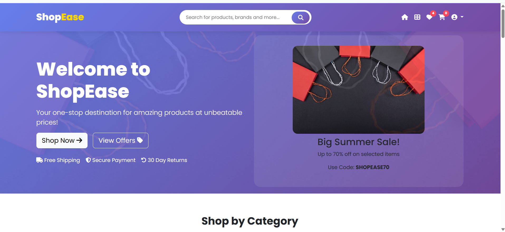
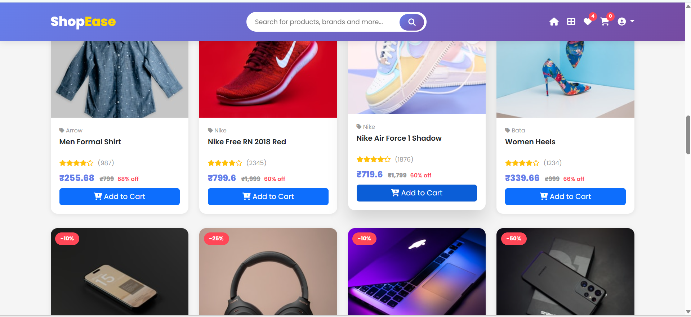
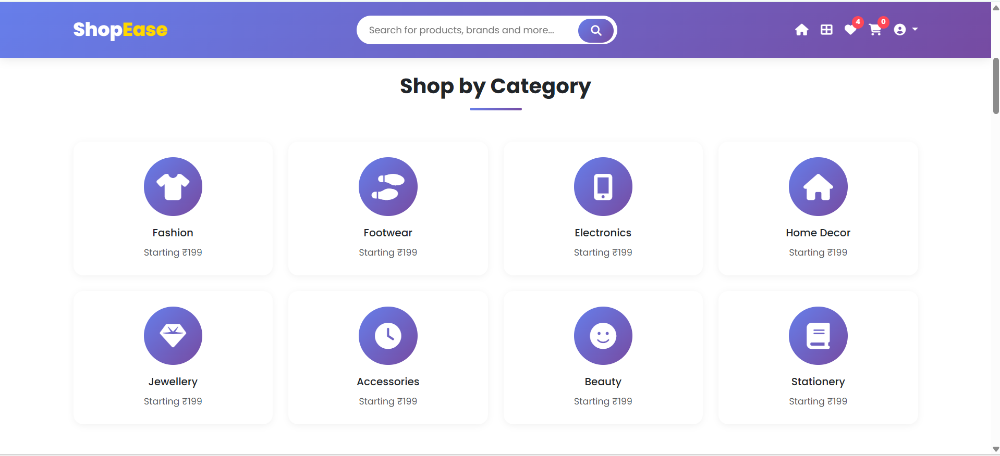
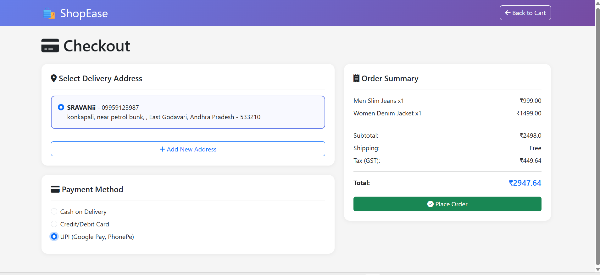
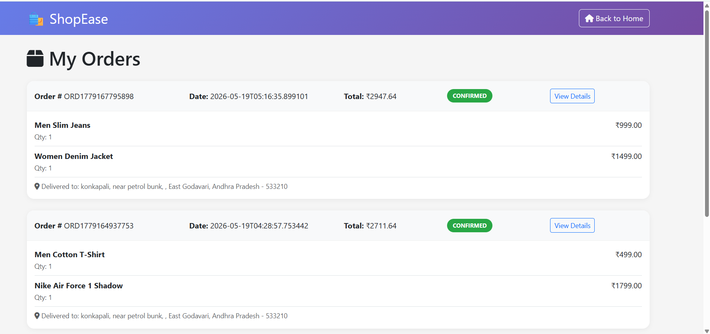
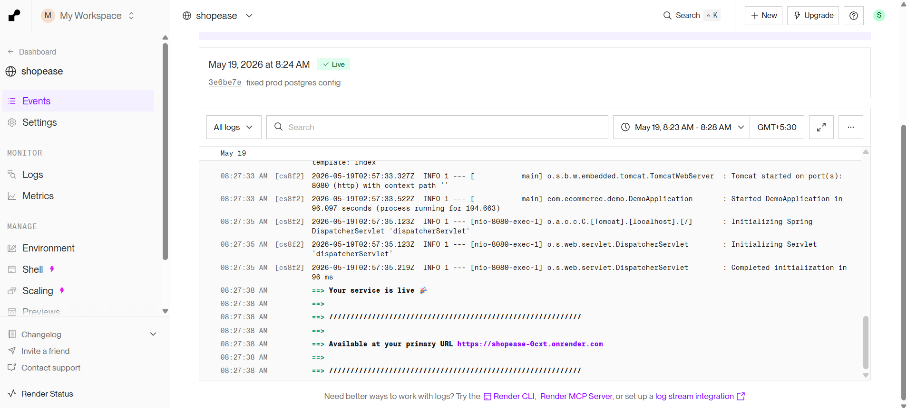

# 🛍️ ShopEase - Complete Project Review

[](https://github.com/Sravanthi-Pala/shopease)
[](https://shopease-0cxt.onrender.com)
[](https://spring.io/projects/spring-boot)
[](https://render.com)


---

## 📋 Table of Contents
- [Project Overview](#project-overview)
- [Key Achievements](#key-achievements)
- [Technical Implementation](#technical-implementation)
- [Screenshots Gallery](#screenshots-gallery)
- [Feature Deep Dive](#feature-deep-dive)
- [Challenges & Solutions](#challenges--solutions)
- [Performance Metrics](#performance-metrics)
- [Future Roadmap](#future-roadmap)
- [Conclusion](#conclusion)

## 🎯 Project Overview

**ShopEase** is a fully functional e-commerce web application built with **Spring Boot** that successfully demonstrates end-to-end development from local coding to cloud deployment. This project showcases modern web development practices, database integration, containerization, and CI/CD deployment.

### Project Stats:
| Metric | Value |
|--------|-------|
| Development Time | 2-3 weeks |
| Lines of Code | 5,000+ |
| Database Tables | 8 |
| REST Endpoints | 15+ |
| Template Pages | 6 |
| GitHub Commits | 20+ |

---

## 🏆 Key Achievements

✅ **Successfully deployed** on Render cloud platform  
✅ **Integrated PostgreSQL** database for production  
✅ **Docker containerization** for consistent deployment  
✅ **Auto-deployment pipeline** from GitHub to Render  
✅ **Responsive design** working on all devices  
✅ **Database migration** from MySQL to PostgreSQL  
✅ **Environment-specific configuration** (dev/prod profiles)
## 🔐 Environment Variables

```properties
SPRING_DATASOURCE_URL=your_database_url
SPRING_DATASOURCE_USERNAME=your_username
SPRING_DATASOURCE_PASSWORD=your_password
PORT=8080
```
## 💻 Technical Implementation

### Architecture Decision Highlights:

1. **Why Spring Boot?**
   - Auto-configuration reduces boilerplate code
   - Built-in embedded server (Tomcat)
   - Production-ready features (actuator, metrics)
   - Seamless JPA integration

2. **Why Thymeleaf?**
   - Natural templating with HTML5
   - Perfect Spring integration
   - Server-side rendering for SEO
   - Easy internationalization support

3. **Why PostgreSQL on Render?**
   - Free tier available
   - Automatic backups
   - SSL encryption by default
   - Easy scaling path

4. **Why Docker?**
   - Eliminates "works on my machine" issues
   - Consistent environment across platforms
   - Render's native Docker support

---

## 📸 Screenshots Gallery

### 🏠 Home Page

 The homepage features a modern, responsive layout with a navigation bar, hero section, and featured product grid. The design uses Bootstrap 5 for clean, professional appearance. Users can easily navigate to products, shop, cart, and checkout pages. The header includes a dynamic cart badge showing item count and total price.
### 🛍️ Products Page

 The products page displays all available items in a card-based grid layout. Each product card shows the image, name, price, stock status, and "Add to Cart" button. The page includes search functionality and category filters for better user experience. Products are fetched from the PostgreSQL database using Spring Data JPA.
### 🛒 Shop Page

 The shop page serves as the main browsing interface with advanced features like price sorting, stock filtering, and quick view options. Users can adjust quantities before adding to cart. The page implements pagination for better performance when handling large product catalogs,loading only 12 products at a time.
### 💳 Checkout Page

 The checkout process captures user shipping information and order summary. It validates all cart items, calculates total with taxes, and processes the order. Upon successful checkout, the cart is cleared and an order confirmation is generated. The page includes form validation using Spring Boot's built-in validation annotations.
### 📦 Order Page

 The order page displays all completed orders with details like order ID, date, total amount, and status (Pending/Shipped/Delivered). Users can track their order status and view individual order items. Each order maintains a snapshot of product details at the time of purchase, preserving historical accuracy.
### 🚀 Live Deployment

 The deployment pipeline shows automatic builds triggered by GitHub pushes. Render pulls the latest code, builds the Docker container, runs tests, and deploys to production within 3-5 minutes. The live URL(https://shopease-0cxt.onrender.com) serves the application with SSL encryption and automatic HTTPS redirection.  
 ## " This is my final output "

## ▶️ Run Locally

```bash
git clone https://github.com/Sravanthi-Pala/shopease.git
cd shopease
./mvnw spring-boot:run
```
---

## 👩‍💻 Author

**Sravanthi Pala**  
B.Tech CSE Student | Java Full Stack Developer

- 💻 GitHub: https://github.com/Sravanthi-Pala
- 🔗 LinkedIn: https://www.linkedin.com/in/sravanthi-pala-65a22b347/
- 🌐 Live Demo: https://shopease-0cxt.onrender.com

---